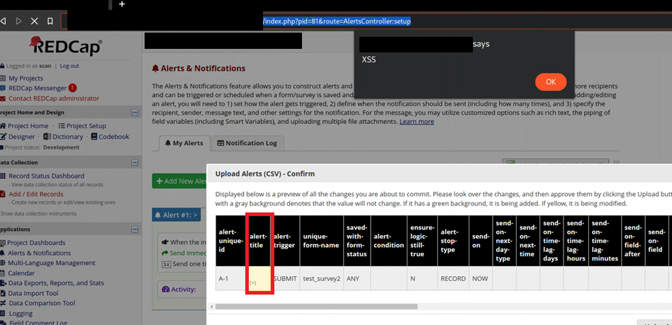

# CVE-2022-42715: Reflected Cross-Site Scripting in REDCap Versions \<12.4.18, 12.5.11

## Issue Summary

A reflected cross-site scripting vulnerability exists in Vanderbilt University's [Project REDCap](https://www.project-redcap.org/) survey management tool, leading to arbitrary JavaScript execution in a user's browser.

The import function in the Alerts & Notifications section of REDCap version 12.4.12 is vulnerable to DOM-based cross-site scripting. By uploading a maliciously crafted CSV to the portal, the alert fields are interpreted without XSS checks during review, leading to JavaScript execution.

## Proof of Exploitation

After uploading the malicious CSV, arbitrary JavaScript executes in the user's browser.

## Issue Impact

Although exploitation of this vulnerability would require a user to upload a maliciously-crafted CSV, if one were provided to the user and uploaded without scrutiny, the user could be coerced to disclose credentials, download malware, or other common JavaScript-based techniques used by attackers.

## Discovery/Disclosure Timeline

* 9/21/22: Vulnerability discovered
* 9/23/22: Vulnerability reported to REDCap
* Ticket #134640 opened by REDCap
* 10/3/22: Patch provided by REDCap
* 10/4/22: CVE Requested
* 10/9/22: CVE-2022-42715 Assigned
* 10/11/22: Writeup Published

## References

* [REDCap Changelog](https://redcap.med.usc.edu/_shib/assets/ChangeLog_Standard.pdf)

