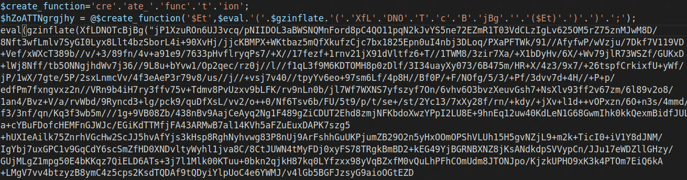
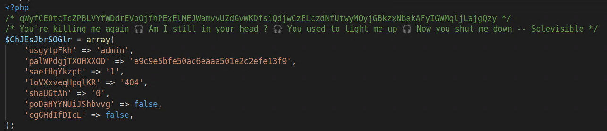
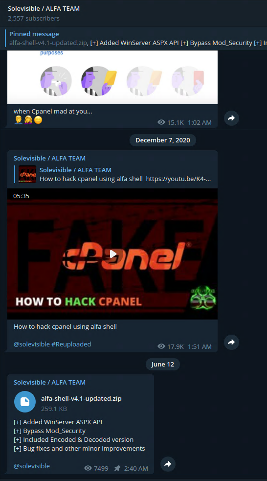
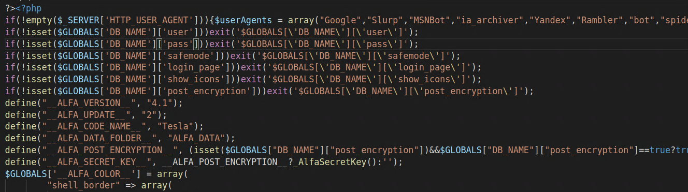
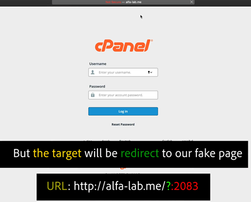
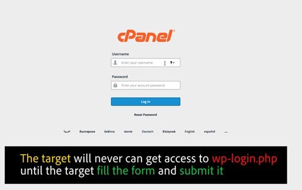
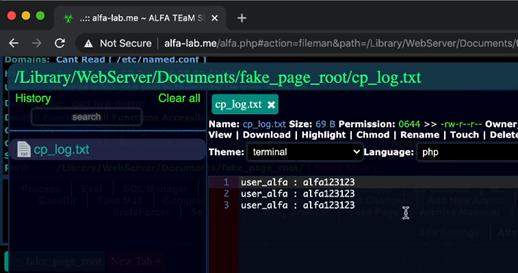

# Advisory: Ongoing Indonesian Gambling WordPress/cPanel Campaign

**Published 13 October 2022**

**TLP: WHITE**

After contending with a particularly interesting WordPress compromise, we wanted you to be aware of this widespread campaign targeted at education, government, and nonprofit sector sites.

The earliest reference to this campaign we could discover was on 27 May 2022 by Twitter user @unmaskparasites:

<blockquote class="twitter-tweet"><p lang="en" dir="ltr">Another variation of Indonesian gambling spam injection via a fake WordPress plugin wp-content/mu-plugins/wp-ultimate-cache-compatibily.php<br>hxxp://173.82[.]206[.]72/ops/1.txt is the source of the hidden spam links <a href="https://t.co/xsla4A1L7O">pic.twitter.com/xsla4A1L7O</a></p>&mdash; Denis (@unmaskparasites) <a href="https://twitter.com/unmaskparasites/status/1530296554451415040?ref_src=twsrc%5Etfw">May 27, 2022</a></blockquote> <script async src="https://platform.twitter.com/widgets.js" charset="utf-8"></script>

## Campaign Scope and Scale

Evidently through simple brute force password guessing, multiple sites have been identified compromised by a group that is utilizing their foothold to create online gambling portals. Here is an example from a compromised site from a major east coast university:


This one is from a prominent Washington, DC think tank:


 
Our sample and similar ones identified appear to be Indonesian in origin, based on the language used in the replaced/defaced sites. One search query that may be useful for detection is something like [https://www.google.com/search?q=intitle:gacor+inurl:..edu](https://www.google.com/search?q=intitle:gacor+inurl:..edu). Replace the `inurl` component with your domain. "Slot Gacor" seems to be a common phrase for these—alternatively, "Situs Judi," which translates to "gambling site" in Indonesian.

Sample searches of the kind listed above show over 240,000 potentially compromised sites in the public sector, and over a million when combined with `.com` sites.

Gambling is technically illegal in Indonesia, however online gambling is incredibly popular. It is possible that this widespread campaign is an attempt to produce a massive network of redirect targets for known domains, establishing a sort of "floating casino" across the internet that would be difficult to entirely shut down.

## Compromise Details

Initial access appears to follow patterns listed in [this](https://noc.org/articles/what-hackers-do-with-wordpress-in-2022-post-hack-analysis) article about common WordPress attacks. Following that, attackers are uploading an obfuscated version of the [ALFA TEAM web shell](https://blog.sucuri.net/2020/11/alfa-team-shell-v4-1-tesla-a-feature-update-analysis.html). The obfuscation is performed by gzipping/base64 encoding the PHP code, and then using eval() to decompress and execute the code on access, meaning that the cleartext web shell never touches the filesystem.


_Initial PHP Dropper using `eval()` and `gzinflate()` to produce at-runtime PHP_

The penultimate loader shows an author signature of "Solevisible." This connects to ALFA TEAM, which was active in 2020 on YouTube and Telegram. The Telegram channel is still up and the web shell is available for download.


_Solevisible signature on pre-loader_


_ALFA TEAM Telegram Group_

After full deobfuscation, the Alfa Web Shell is plain: 



This matches the code from the Telegram sample precisely. Given the nature of distribution, it unlikely that the developers of this shell are responsible for the compromises leading to these gambling sites.

## Escalation from WordPress to cPanel

ALFA TEAM is a known web exploit developer, and this web shell has some very advanced capabilities. Of particular note is the ability to clone and spoof login pages, including cPanel admin portals. In fact, a video from ALFA TEAM instructs attackers on how to use this feature to pivot from a single WordPress site compromise to an entire cPanel instance. The following screenshots, taken from a video posted on ALFA TEAM’s Telegram channel, demonstrate the process. 
 


_Fake cPanel login page_


_Fake page is configured to "fail" 3 times to confirm password capture_


_Alfa Shell captures the creds_

Now this demo is for cPanel, but this technique could also be used to attempt capture of SSO credentials from unwitting users. It's important to remember that not all WordPress operators are system administrators by training, so the attack possibility space is quite vast.

## Mitigation/Remediation

Given the various obfuscation methods, a simple YARA rule or file hash will be unreliable for detection. Nevertheless, a YARA rule is provided to search for the encoded ALFA shell. In addition to the search above for compromised sites in your area of responsibility, it is recommended to review all WordPress and cPanel site access for the last 6 months. Any files with anomalous timestamps merit investigation. Now may be a good time to reset/strengthen all cPanel and WordPress credentials in use.

Additionally, the ALFA TEAM web shell may use the local database configuration for persistence, so reviewing tables/entries is advised.

## YARA Rule

```yara
/*
    Although this web shell has been around for a minute, I could not 
    find any good rules for detection. Enjoy!
    Published 2022-10-13
*/
rule php_alfa_team
{
    meta:
        author      = "Michael Taggart https://github.com/mednet-mtaggart"
        date        = "2022/10/13"
        description = "Detects ALFA TEAM's web shell"
    strings:
        $a = "<?php"
        $b = "set_time_limit(0)"
        $c = "'fun'.'ct'.'i'.'o'.'n_exi'.'s'.'ts'"
        $d = "'e'.'v'.'a'.'l'"
        $e = "'gzin'.'f'.'l'.'a'.'te'"
    condition:
        all of them
}
```
